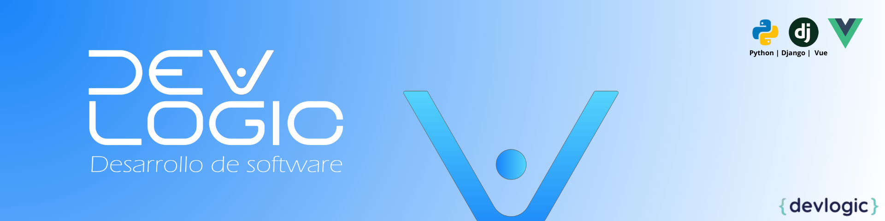

#  Dev Logic - Desarrollo de Software

**Dev Logic** es una empresa de desarrollo de software dedicada a crear soluciones innovadoras y eficientes. Nos enfocamos en proyectos de backend y desarrollo web utilizando tecnologías de última generación, aplicando buenas prácticas de desarrollo y estándares de calidad profesional.

---

## Tecnologías
> 
<strong>Backend:</strong> Python, Django, Flask

> 
<strong>Frontend:</strong> Vue

> 
<strong>Base de datos:</strong> MySQL

  
  
  
  
  

