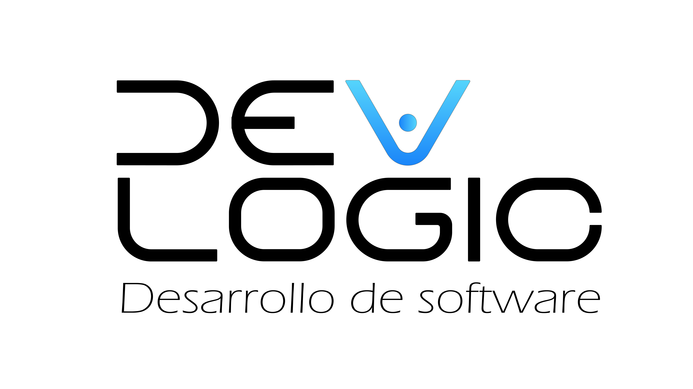

#  Dev Logic - Desarrollo de Software

**Dev Logic** es una organización dedicada a crear proyectos innovadores de backend, análisis de datos y desarrollo web con Python, Flask, Django y más. Nuestro objetivo es entregar soluciones eficientes y profesionales, mostrando buenas prácticas de desarrollo.

---

## 🔖 Badges

---

## 🚀 Proyectos destacados

- [**WebScraping Project**](https://github.com/Dev-Logic-Desarrollo-de-software/WebScraping-Project)  
  Extrae datos de productos automáticamente y los guarda en CSV.

- [**Email SMTP API**](https://github.com/Dev-Logic-Desarrollo-de-software/email-smtp-api)  
  API desarrollada con Flask para el envío de correos electrónicos de forma segura.

*(Agrega aquí más proyectos conforme los vayas creando)*

---

## 📸 Vista previa

  
*Ejemplo de la extracción de datos en acción.*

---

## 💻 Tecnologías utilizadas

- Python 3.11  
- Flask 3.1.2  
- Django 4.2  
- MySQL / MariaDB  
- HTML, CSS, HTMX y Alpine.js (para frontend en proyectos específicos)

---

## 📫 Contacto

- LinkedIn: [Alejandro Guarín](https://www.linkedin.com/in/alejandro-guarin-dev/)  
- Email: alejandro.guarin.dev@gmail.com  

---

## ⚡ Cómo contribuir

Actualmente este repositorio es solo informativo, pero pronto podrás contribuir a nuestros proyectos siguiendo las buenas prácticas de GitHub.

